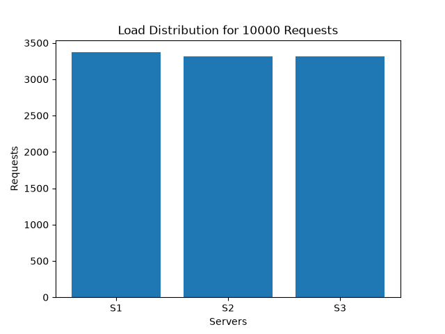
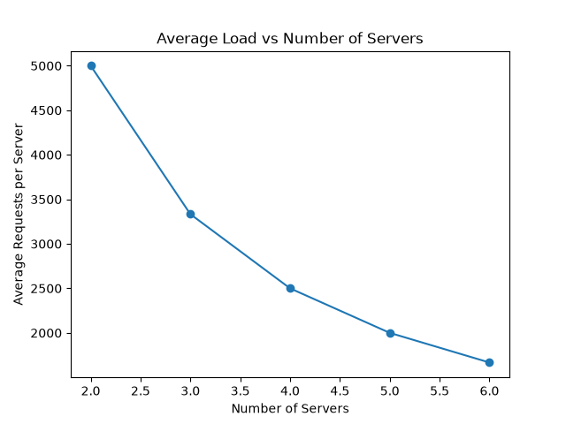
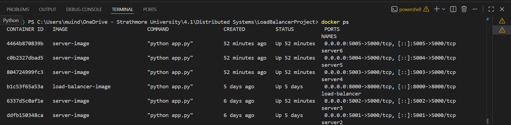
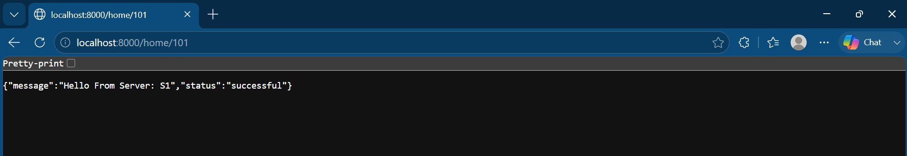

# Distributed Systems Load Balancer Project

## Overview

This project implements a load balancer for distributing client requests across multiple server replicas using Consistent Hashing.

The objective is to simulate how modern distributed systems distribute workloads efficiently among several servers while maintaining scalability and fault tolerance.

The project was implemented using:

- Python
- Flask
- Docker
- Consistent Hashing

---

## Project Structure

```
LoadBalancerProject
│
├── server/
│   ├── app.py
│   ├── Dockerfile
│   └── requirements.txt
│
├── load_balancer/
│   ├── app.py
│   ├── consistent_hash.py
│   ├── Dockerfile
│   ├── requirements.txt
│   ├── test_hash.py
│   └── test_docker.py
│
├── experiments/
│   ├── load_test.py
│   ├── experiment_a2.py
│   ├── A1_bar_chart.png
│   └── A2_line_chart.png
│
└── README.md
```

---

## Installation

### Clone Repository

```bash
git clone <repository-url>
cd LoadBalancerProject
```

### Build Server Image

```bash
cd server

docker build -t server-image .
```

### Build Load Balancer Image

```bash
cd ../load_balancer

docker build -t load-balancer-image .
```

---

## Running the Project

### Start Server Replicas

```bash
docker run -d --name server1 -e SERVER_ID=S1 -p 5000:5000 server-image

docker run -d --name server2 -e SERVER_ID=S2 -p 5001:5000 server-image

docker run -d --name server3 -e SERVER_ID=S3 -p 5002:5000 server-image
```

### Start Load Balancer

```bash
docker run -d --name load-balancer -p 8000:8000 load-balancer-image
```

---

## Usage

Access:

```text
http://localhost:8000/home/<client_id>
```

Examples:

```text
http://localhost:8000/home/101

http://localhost:8000/home/202

http://localhost:8000/home/303
```

The load balancer hashes the client ID and routes the request to the corresponding server.

---

## Consistent Hashing

The load balancer uses a Consistent Hash Ring to:

- Distribute requests evenly
- Minimize remapping when servers change
- Improve scalability

---

# Testing

## Hash Ring Test

```bash
python test_hash.py
```

Expected Output:

```text
101 -> S2
202 -> S1
303 -> S3
404 -> S2
```

---

## Docker Connectivity Test

```bash
python test_docker.py
```

This verifies communication with running Docker containers.

---

# Analysis

## A1: Load Distribution for 10,000 Requests

10,000 asynchronous requests were generated and sent through the load balancer.

### Results

| Server | Requests |
|----------|----------|
| S1 | 3370 |
| S2 | 3315 |
| S3 | 3315 |

### Observation

The requests were distributed almost equally across the three servers.

This demonstrates that the Consistent Hashing algorithm provides balanced load distribution and avoids overloading a single server.

## A1 Results



---

## A2: Scalability Analysis

The number of servers was increased from 2 to 6.

| Servers | Average Requests |
|----------|----------|
| 2 | 5000 |
| 3 | 3333 |
| 4 | 2500 |
| 5 | 2000 |
| 6 | 1667 |

### Observation

As the number of servers increases, the average load handled by each server decreases proportionally.

This demonstrates that the load balancer scales effectively as additional servers are introduced.

## A2 Results



---

## A3: Failure Handling

A server container was manually stopped during testing.

Example:

```bash
docker stop server2
```

Observation:

Requests mapped to the failed server returned an error response.

The load balancer detected that the server was unavailable and did not crash.

This demonstrates basic fault tolerance.

---

## A4: Hash Function Modification

Alternative hash functions can be introduced to study their impact on load distribution.

In general:

- Better hash functions produce more uniform load distribution.
- Poor hash functions may create hotspots and imbalance.

---

# Limitations

The project successfully demonstrates:

- Consistent hashing
- Dockerized server replicas
- Request routing
- Load distribution
- Basic failure handling

Automatic spawning of replacement containers using the Docker SDK was explored but not fully implemented due to environment constraints and project time limitations.

---
## Running Containers



## Load Balancer Response




# Dependencies

- Flask
- Requests
- Docker SDK for Python
- aiohttp
- matplotlib

---

# Author

Distributed Systems Programming Group Project
# Group Members

| Name | Registration Number |
|--------|--------|
| Martha Muinde | 166319 |
| Hope Murimi | 150468 |
| Tim Hubert | 166070 |
| Paula Njenga | 143109 |

Strathmore University